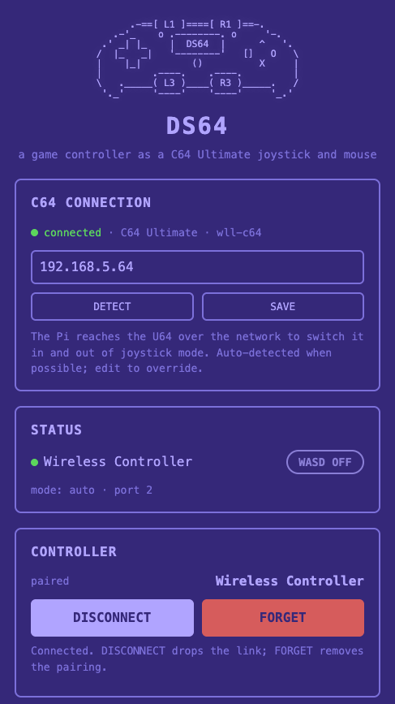
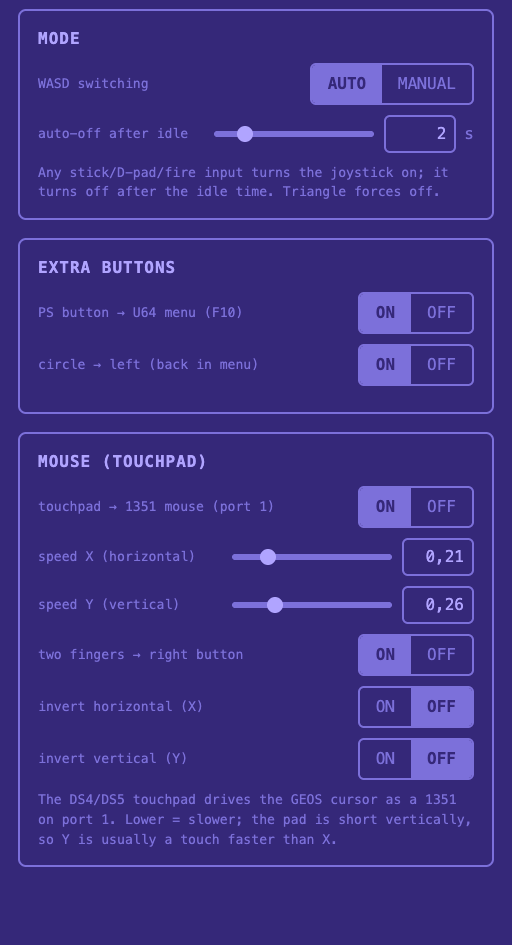

# DS64 — a PlayStation 4/5 controller (DualShock 4 / DualSense) as a Commodore 64 joystick + 1351 mouse (no soldering, no custom hardware)

> Plug a Raspberry Pi into your Commodore 64 Ultimate, pair a Sony **DualShock 4
> (PS4)** or **DualSense (PS5)** controller over Bluetooth, and play. No joystick,
> no special adapter to buy, no soldering, no changes to your C64 — all you add is a
> Raspberry Pi and free software.

Maybe your joystick hasn't arrived yet, you never got around to buying one, the
old one finally gave out, or you just prefer a modern controller — either way you
can play right now with a pad you already own.

It also fixes a classic frustration: you own **one** joystick but the game is
two-player. Set DS64 up as the **second** joystick — it can sit on either control
port — so one player uses the real stick and the other the controller.

And because it's a **Bluetooth** controller, you play **wirelessly** from the
sofa — no short joystick cable tethering you to the machine.

On a **DualShock 4** or **DualSense** there's a bonus: the **touchpad** works as a
**Commodore 1351 mouse** at the same time as the joystick, so a single controller
drives **GEOS** and your games without unplugging anything (see
[Mouse (touchpad)](#mouse-touchpad)).

<p align="center">
  
  
</p>

Everything is driven from a small **web panel** — detect the C64, pair the
controller, pick the port and tune the behaviour. No config files, no terminal.

## How it works

Three pieces, no custom firmware:

1. The C64 Ultimate firmware has a built-in **joystick mode** that maps the
   **W / A / S / D** keys (and **RETURN** as fire) to a **real** joystick the C64
   reads at the control port.
2. A Raspberry Pi plugged into the U64's **USB-C** port presents itself as a
   plain **USB keyboard** (plus a **USB mouse** for the touchpad — see below).
3. A small daemon on the Pi reads a **Bluetooth game controller** and "presses"
   W/A/S/D/RETURN. The U64 turns those keystrokes into joystick movement. The
   daemon **switches joystick mode on by itself** when you touch the controller and
   **off again** when you stop — no U64 menus — so the very same keyboard **types
   letters** the rest of the time. You play and type without ever swapping anything
   (see [Modes](#modes-automatic-switching)).

```
controller --BT--> Raspberry Pi --USB-C--> C64 Ultimate --> game
                (USB keyboard + mouse)    (joystick + 1351 mouse)
```

Directions come from **either analog stick or the D-pad**; fire from
**X / L1 / R1 / L2 / R2** (any of them).

On a DualShock 4 / DualSense the **touchpad** comes along for free, still over
**Bluetooth** — nothing extra to plug in. The Pi sends its motion down the same
**USB-C link to the U64** as a second device (a plain USB mouse), and the U64 reads
it as a **Commodore 1351** on **control port 1**, independently of the joystick
(Port 2 by default) — one wireless controller, both at once. See
[Mouse (touchpad)](#mouse-touchpad).

That joystick-mode switching happens **over the network** (it's why the U64 needs
its remote-control feature on), and the controller's lightbar shows the state —
**green** while the joystick is live, **blue** when idle.

## What you need

- A **Commodore 64 Ultimate** (tested on factory firmware `c64u_v1.1.0`), **on
  your network** (Ethernet or WiFi), with its **network/remote-control feature
  enabled** in the U64's own settings — that network connection is what the Pi uses
  to switch joystick mode on and off. The original **Ultimate 64** boards should
  work too (they share the firmware and USB host), but that's untested.
- A **Raspberry Pi** with a USB **gadget-capable** port, on the **same network** as
  the U64 (Ethernet or WiFi) — a **Pi 4 Model B** is the tested reference. On the Pi
  4 the **USB-C** port becomes the C64 link and can also power the Pi straight from
  the U64. See [Supported Raspberry Pi models](#supported-raspberry-pi-models).
- A **PlayStation 4 or 5 controller** — a Sony DualShock 4 (PS4) or DualSense
  (PS5). See [Compatible controllers](#compatible-controllers) for other pads.

## Supported Raspberry Pi models

DS64 makes the Pi a **USB gadget** (it pretends to be the C64's keyboard and mouse)
and uses the Pi's **built-in Bluetooth** for the controller. Only **one specific
port** can do the gadget job — the single port wired to the SoC's **OTG /
peripheral** controller, which can run in *device* mode rather than just *host*
mode. On the **Pi 4 / 5** that's the **USB-C** port; on the **Zero 2 W** the
dedicated **micro-USB (USB)** port; on the **3 A+** its lone **USB-A**. The hard
requirement is simply that the board *has* such a port.

| Raspberry Pi model  | Status                     |
| ------------------- | -------------------------- |
| **Pi 4 Model B**    | **Tested** — the reference |
| Pi 5                | Should work (untested)     |
| Pi Zero 2 W         | Likely (untested)          |
| Pi 3 Model A+       | Likely (untested)          |
| Pi 3 Model B / 3 B+ | **Not supported**          |

**Only the Pi 4 Model B has actually been tested** — the rest are listed by how
their USB hardware is wired, not from experience.

The **Pi 3 B / 3 B+** are the exception: their OTG port is eaten by the onboard
USB/Ethernet hub chip and the micro-USB is power-only, so no port is free to be a
USB device. The **3 A+** escapes this — it has no such hub, so its USB-A is wired
straight to the SoC.

## Install

**1. Flash the SD card.** Use the official **[Raspberry Pi
Imager](https://www.raspberrypi.com/software/)**. The **Lite** image is enough — no
desktop needed: choose **Raspberry Pi OS (other) -> Raspberry Pi OS Lite
(64-bit)**. Open the **OS customisation** settings and set the **hostname**, a
**username and password**, and your **WiFi**, so the Pi joins your network on first
boot.

**2. Log in to the Pi.** The friendliest way — no SSH client, just a browser — is
**[Raspberry Pi Connect](https://www.raspberrypi.com/software/connect/)**: turn it
on once on the Pi and link it to your Raspberry Pi account, then open the device's
**terminal** from [connect.raspberrypi.com](https://connect.raspberrypi.com) for a
shell prompt. (Plain **SSH** works too — enable it in Imager and connect with the
username you set.)

**3. Run the installer.** At the prompt, paste:

```
curl -fsSL https://raw.githubusercontent.com/wallneradam/DS64/main/install.sh | sudo bash
```

`sudo` asks for the **password you set in Imager**.

That's it. The installer sets up USB gadget mode, the controller drivers, the
Bluetooth bonding policy, and installs + enables the background services (the USB
keyboard, the bridge daemon, the web panel, and helpers that keep the C64 link and
controller reconnect reliable). It then prints the address of the web panel.

On the **first** install the Pi needs **one reboot** — it activates USB gadget mode
and, by default, **appliance mode** (the read-only, power-loss-proof system
described below). When it finishes the installer offers to reboot for you — just
press **ENTER** (or Ctrl-C to do it later with `sudo reboot`). The **web panel only
responds after that reboot**.

- **Update later:** the system is read-only by default, so first run `sudo
  ds64-unlock` (it reboots), then re-run the install command — it pulls the latest
  version *and* re-hardens for you.
- **Skip the read-only mode:** prefix the install command with `DS64_NO_HARDEN=1` to
  leave the card writable. Not recommended — a power cut can then corrupt it (see
  [Appliance mode](#appliance-mode-read-only-power-loss-proof)).

## First run

Open the web panel in any browser on your network — phone, tablet or computer:

```
http://<hostname>.local:8080/
```

`<hostname>` is whatever you set in Raspberry Pi Imager (so if you set `ds64`, it's
`http://ds64.local:8080/`). If `.local` doesn't load — it can fail on some Windows
and Android setups — use the Pi's **IP address** instead (the installer printed it;
you can also find it in your router's device list): `http://<pi-ip>:8080/`.

Then:

1. **C64 connection.** The panel scans your network for the U64 automatically. If
   it doesn't find it, press **DETECT**, or type the U64's IP address (shown in the
   U64's own network/settings screen) and press **SAVE**. DETECT only scans the Pi's
   own network, so if the U64 is on a different subnet you'll need to enter its IP by
   hand. When it's reachable the dot turns green and shows the U64's name. If it
   stays red, check the U64 is on the network and its network feature is enabled.
2. **Pair the controller.** Press **PAIR CONTROLLER**, then put the pad in pairing
   mode — hold **SHARE + PS** until the lightbar double-flashes. It pairs, trusts
   and connects in one go, and the bond is made durable so it **reconnects with a
   single PS press** after a power-off. If the panel warns the pairing "is not
   durable yet", press **FORGET** and **PAIR** again. Once paired you also get
   **DISCONNECT** (drops the link; a PS press reconnects) and **FORGET** (removes the
   pairing, e.g. to switch to a different pad).
3. **Play.** Move a stick or the D-pad and press fire. The U64 flips into joystick
   mode by itself and the game sees a joystick. Pick **Port 1** or **Port 2** in
   the panel to match the game.

No need to touch the U64's own menus — the daemon sets its joystick mode for you
(RAM-only, so it reverts on the U64's next power-off).

## Modes (automatic switching)

The panel's **MODE** switch decides how the joystick turns on and off:

- **AUTO** (default) — any stick / D-pad / fire input turns the joystick **on**;
  after a short idle time it turns **off** again, so **W/A/S/D go back to being
  normal keys** for typing. The idle time is adjustable in the panel (a couple of
  seconds by default, up to a few minutes). Pressing **Triangle** turns it off
  while you're playing. This is the "play, then type, then play" mode — best for
  most use.
- **MANUAL** — the **Triangle** button toggles the joystick on and off; input
  alone never switches it. Use this if you want the joystick to stay on regardless.

**Extra buttons** (each can be turned off in the panel):

- **PS button** opens the **U64 menu** (sends F10 on release).
- **Circle** acts as **Left** — the "back" direction inside the U64 menu.

## Mouse (touchpad)

On a **DualShock 4** or **DualSense** the **touchpad** doubles as a **Commodore
1351 proportional mouse** — at the same time as the joystick, from the same
controller. The Pi presents the touchpad as a second USB device (a plain mouse)
and the U64 reads it as a 1351 on **control port 1**, while the joystick stays on
**port 2**. It's on by default; everything below is in the panel's **MOUSE
(TOUCHPAD)** card.

- **Move** the cursor by sliding one finger on the pad. Motion is relative, so
  lifting and re-touching never makes the cursor jump.
- **Left button:** physically click the pad. **Right button:** touch with **two
  fingers** (this can be turned off).
- **Speed X** and **Speed Y** are separate sliders. The pad is short
  top-to-bottom, so Y is usually set a touch faster than X. Lower = slower.
- **Invert X / Y** flip a direction if it ever feels reversed.

This drives the **GEOS** pointer and anything else that speaks 1351. The mouse is
always on **port 1**, and a joystick on port 1 would clash with it, so the panel
keeps the two apart for you: turning the **mouse on** moves the **joystick to Port
2**, and choosing **Port 1** for the joystick turns the **mouse off**. With the
mouse on you get the mouse on port 1 and the joystick on port 2 — both at once.

Only the DualShock 4 and DualSense have a touchpad; other pads keep the joystick
but have no mouse.

## Compatible controllers

The bridge works with any standard gamepad Linux recognises, so it isn't tied to
one specific pad. In practice:

- **Sony DualShock 4 (PS4)** — the reference controller, **tested**. Pairs over
  Bluetooth as "Wireless Controller" and works out of the box, lightbar status
  and the **touchpad mouse** included.
- **Sony DualSense (PS5)** — works the same way, lightbar status and touchpad
  mouse included.
- **Other generic USB/Bluetooth gamepads** — many cheap pads also work for
  directions, fire and the menu buttons. No lightbar status on non-Sony pads (only
  cosmetic), and no touchpad, so no mouse.

**Xbox-style / XInput controllers** (Xbox One/Series, and many third-party pads in
"XInput" mode) are only a partial fit today: the **D-pad, buttons and triggers
work**, but the **analog sticks read as permanently pushed**. Use the D-pad for
now — full analog support is on the [Roadmap](#roadmap).

## Appliance mode (read-only, power-loss proof)

A C64 has no shutdown button — you just flip the switch. So the installer makes the
Pi survive that **by default**: the root filesystem is **read-only** (runtime writes
go to RAM and are dropped on reboot, so yanking power can't corrupt the SD card),
while a small journaled image keeps the few things that must persist — the
controller bond, your WiFi profiles and the DS64 config. Just power the Pi off with
the C64; there's nothing to shut down. This is also why the WiFi/bond/config you set
**after** the install (pairing a pad, picking the C64) still survive a power cut.

To **update** the software or use the Pi for other things, unlock it first:

```
sudo ds64-unlock    # make the system writable again, then reboots
```

After it reboots, re-run the install command (it pulls the latest version and
re-hardens for you). To re-harden by hand at any time:

```
sudo ds64-lock      # back to the read-only appliance (one reboot)
```

Both commands are reversible and safe to re-run. To install **without** hardening in
the first place, prefix the install command with `DS64_NO_HARDEN=1`.

## Limitations

- **One joystick** (you choose Port 1 or 2 in the panel). Two of *these* at once
  aren't possible on the factory firmware — but you can pair it with a **real**
  joystick on the other port for two-player.
- **The mouse and a port-1 joystick can't coexist** — the U64 hardwires a USB
  mouse to port 1. The panel keeps them exclusive: turning the mouse on moves the
  joystick to Port 2, and choosing Port 1 turns the mouse off.
- While the joystick is **active**, W/A/S/D and RETURN are the joystick and can't
  be typed. AUTO mode frees them automatically as soon as you stop playing, so in
  practice this only matters mid-game.

## License

GPLv3 — see [LICENSE](LICENSE).
