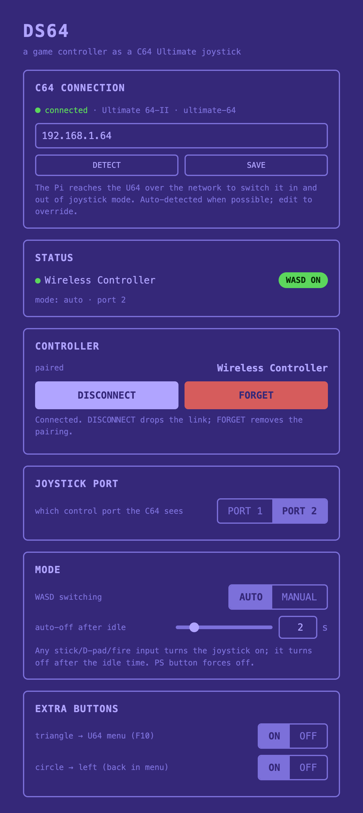

# DS64 — a PlayStation 4/5 controller (DualShock 4 / DualSense) as a Commodore 64 joystick (no soldering, no custom hardware)

> Plug a Raspberry Pi into your Commodore 64 Ultimate, pair a Sony **DualShock 4
> (PS4)** or **DualSense (PS5)** controller over Bluetooth, and play. No joystick,
> no special adapter to buy, no soldering, no changes to your C64 — all you add is a
> Raspberry Pi and free software.

Maybe your joystick hasn't arrived yet, you never got around to buying one, the
old one finally gave out, or you just prefer a modern controller — either way you
can play right now with a pad you already own.

It also fixes a classic frustration: you own **one** joystick but the game is
two-player. Set DS64 up as the **second** joystick — it can sit on either control
port — so one player uses the real stick and the other the controller.

And because it's a **Bluetooth** controller, you play **wirelessly** from the
sofa — no short joystick cable tethering you to the machine.

<p align="center">
  
</p>

Everything is driven from a small **web panel** — detect the C64, pair the
controller, pick the port and tune the behaviour. No config files, no terminal.

## How it works

Three pieces, no custom firmware:

1. The C64 Ultimate firmware has a built-in **joystick mode** that maps the
   **W / A / S / D** keys (and **RETURN** as fire) to a **real** joystick the C64
   reads at the control port.
2. A Raspberry Pi plugged into the U64's **USB-C** port presents itself as a
   plain **USB keyboard**.
3. A small daemon on the Pi reads a **Bluetooth game controller** and "presses"
   W/A/S/D/RETURN. The U64 turns those keystrokes into joystick movement.

```
controller --BT--> Raspberry Pi --USB-C--> C64 Ultimate --> game
                (USB keyboard gadget)   (WASD -> joystick)
```

Directions come from **either analog stick or the D-pad**; fire from
**X / L1 / R1 / L2 / R2** (any of them).

The daemon also flips the U64 **into and out of** joystick mode for you, over the
network: when you touch the controller it switches the U64 to WASD; when you stop,
it switches back to normal so **W/A/S/D type as letters again** (see
[Modes](#modes-automatic-switching)). The controller's lightbar shows the state —
**green** while the joystick is live, **blue** when idle.

## What you need

- A **Commodore 64 Ultimate II** (tested on factory firmware `c64u_v1.1.0`), **on
  your network** (Ethernet or WiFi), with its **network/remote-control feature
  enabled** in the U64's own settings — that network connection is what the Pi uses
  to switch joystick mode on and off.
- A **Raspberry Pi 4 Model B** on the **same network** as the U64. Its USB-C port
  becomes the keyboard; the four USB-A ports stay in host mode for Bluetooth. It
  can be powered straight from the U64's USB-C port.
- A **PlayStation 4 or 5 controller** — a Sony DualShock 4 (PS4) or DualSense
  (PS5). See [Compatible controllers](#compatible-controllers) for other pads.

## Install

Flash **Raspberry Pi OS** (Bookworm or newer) with the official **Raspberry Pi
Imager**, and in its settings set the **hostname**, enable **SSH**, and configure
your **WiFi** so the Pi joins your network. Boot the Pi and log in — the easiest
way for non-Linux users is **[Raspberry Pi Connect](https://www.raspberrypi.com/software/connect/)**
(a shell in your browser, no SSH client needed); SSH works too, with the username
you set in Imager. Then run:

```
curl -fsSL https://raw.githubusercontent.com/wallneradam/DS64/main/install.sh | sudo bash
```

That's it. The installer sets up USB gadget mode, the controller drivers, the
Bluetooth bonding policy, and installs + enables the background services (the USB
keyboard, the bridge daemon, the web panel, and helpers that keep the C64 link and
controller reconnect reliable). It then prints the address of the web panel.

When it finishes, the installer may print a `sudo reboot` line — if it does, run it
yourself (USB gadget mode needs one reboot the first time). Later re-runs don't ask
for a reboot.

- **Update later:** re-run the exact same command — it just pulls the latest
  version and restarts the services. Re-running is always safe; it only fixes
  what's wrong.
- It doesn't repartition your card or make anything read-only — that's a separate,
  optional step (see [Appliance mode](#appliance-mode-power-loss-proof-optional)).

## First run

Open the web panel in any browser on your network — phone, tablet or computer:

```
http://<hostname>.local:8080/
```

`<hostname>` is whatever you set in Raspberry Pi Imager (so if you set `ds64`, it's
`http://ds64.local:8080/`). If `.local` doesn't load — it can fail on some Windows
and Android setups — use the Pi's **IP address** instead (the installer printed it;
you can also find it in your router's device list): `http://<pi-ip>:8080/`.

Then:

1. **C64 connection.** The panel scans your network for the U64 automatically. If
   it doesn't find it, press **DETECT**, or type the U64's IP address (shown in the
   U64's own network/settings screen) and press **SAVE**. DETECT only scans the Pi's
   own network, so if the U64 is on a different subnet you'll need to enter its IP by
   hand. When it's reachable the dot turns green and shows the U64's name. If it
   stays red, check the U64 is on the network and its network feature is enabled.
2. **Pair the controller.** Press **PAIR CONTROLLER**, then put the pad in pairing
   mode — hold **SHARE + PS** until the lightbar double-flashes. It pairs, trusts
   and connects in one go, and the bond is made durable so it **reconnects with a
   single PS press** after a power-off. If the panel warns the pairing "is not
   durable yet", press **FORGET** and **PAIR** again. Once paired you also get
   **DISCONNECT** (drops the link; a PS press reconnects) and **FORGET** (removes the
   pairing, e.g. to switch to a different pad).
3. **Play.** Move a stick or the D-pad and press fire. The U64 flips into joystick
   mode by itself and the game sees a joystick. Pick **Port 1** or **Port 2** in
   the panel to match the game.

No need to touch the U64's own menus — the daemon sets its joystick mode for you
(RAM-only, so it reverts on the U64's next power-off).

## Modes (automatic switching)

The panel's **MODE** switch decides how the joystick turns on and off:

- **AUTO** (default) — any stick / D-pad / fire input turns the joystick **on**;
  after a short idle time it turns **off** again, so **W/A/S/D go back to being
  normal keys** for typing. The idle time is adjustable in the panel (a couple of
  seconds by default, up to a few minutes). Pressing **PS** turns it off while
  you're playing. This is the "play, then type, then play" mode — best for most use.
- **MANUAL** — the **PS** button toggles the joystick on and off; input alone
  never switches it. Use this if you want the joystick to stay on regardless.

**Extra buttons** (each can be turned off in the panel):

- **Triangle** opens the **U64 menu** (sends F10).
- **Circle** acts as **Left** — the "back" direction inside the U64 menu.

## Compatible controllers

The bridge works with any standard gamepad Linux recognises, so it isn't tied to
one specific pad. In practice:

- **Sony DualShock 4 (PS4)** — the reference controller, **tested**. Pairs over
  Bluetooth as "Wireless Controller" and works out of the box, lightbar status
  and all.
- **Sony DualSense (PS5)** — works the same way, lightbar status included.
- **Other generic USB/Bluetooth gamepads** — many cheap pads also work for
  directions, fire and the menu buttons. No lightbar status on non-Sony pads, but
  that's only cosmetic.

**Xbox-style / XInput controllers** (Xbox One/Series, and many third-party pads in
"XInput" mode) are only a partial fit today: the **D-pad, buttons and triggers
work**, but the **analog sticks read as permanently pushed**. Use the D-pad for
now — full analog support is on the [Roadmap](#roadmap).

## Appliance mode (power-loss proof, optional)

A C64 has no shutdown button — you just flip the switch. Once everything works,
you can make the Pi survive that the same way:

```
sudo ds64-lock      # turn the Pi into a read-only appliance (one reboot)
```

This makes the root filesystem **read-only** (so yanking power can't corrupt the
SD card) while keeping the few things that must persist — the controller bond,
your WiFi profiles and the DS64 config. After this, just power the Pi off with the
C64; there's nothing to shut down.

To update the software or use the Pi for other things again, undo it first:

```
sudo ds64-unlock    # make the system writable again, then re-run the installer
```

Both commands are reversible and safe to re-run.

## Limitations

- **One joystick** (you choose Port 1 or 2 in the panel). Two of *these* at once
  aren't possible on the factory firmware — but you can pair it with a **real**
  joystick on the other port for two-player.
- While the joystick is **active**, W/A/S/D and RETURN are the joystick and can't
  be typed. AUTO mode frees them automatically as soon as you stop playing, so in
  practice this only matters mid-game.

## Roadmap

- **Wider controller support:** auto-detect each controller's axis range so
  Xbox/XInput pads (and any other gamepad) work fully, not just Sony pads.

## License

GPLv3 — see [LICENSE](LICENSE).
